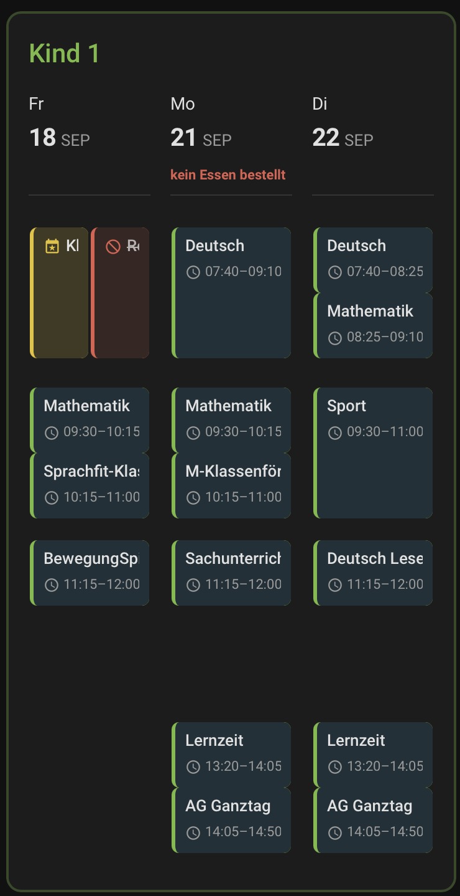

# Family School Cards

Vier kompakte Lovelace-Karten für Home Assistant, die **Stundenpläne,
Hausaufgaben und Klausuren von Kindern** lesbar auf dem Dashboard darstellen.

**Funktioniert mit jeder HA-Kalender-Entity** — Google Calendar, CalDAV
(z. B. iServ), ICS/Remote-Kalender, lokaler HA-Kalender. Entstanden ist das
Kartenset aus dem Bedarf rund um **WebUntis** (über die Integration
[`JonasJoKuJonas/homeassistant-WebUntis`](https://github.com/JonasJoKuJonas/homeassistant-WebUntis)),
und WebUntis bleibt die am besten unterstützte Quelle: **nur dort** blendet die
Stundenplan-Karte zusätzlich Farb-/Statuskennungen für **entfallene Stunden,
Vertretungen und Sonderveranstaltungen** ein (Heuristik über die
`Cancelled:`/`Irregular:`-Präfixe im `summary`). Mit anderen Kalendern werden
Einträge schlicht als normale Blöcke gezeigt — voll funktionsfähig, nur ohne
diese Hervorhebung.

[](https://my.home-assistant.io/redirect/hacs_repository/?owner=jot-koehler&repository=webuntis-family-cards&category=plugin)

Der Badge fügt das Repository direkt als benutzerdefiniertes Repository in
HACS hinzu (Klick, dann bestätigen) — die Schritte 1 und 2 unter
[Installation über HACS](#installation-über-hacs) entfallen damit.

Reines Frontend-Plugin (Lovelace-Karten), **keine** Home-Assistant-Integration:
kein Python, kein Neustart bei Updates, Installation und Updates laufen über
HACS wie bei jeder anderen Custom Card.

## Enthaltene Karten

| Karte | Zweck | Für |
|---|---|---|
| `family-timetable-card` | Zeitraster-Stundenplan — wahlweise rollend (heute + folgende Tage) oder als feste Kalenderwoche mit Blättern, Klick-Detail-Popup, optionaler Mensa-Hinweis | ein Kind |
| `family-overview-card` | Kompakte "Wer muss wann los"-Balkenübersicht | mehrere Kinder |
| `family-homework-card` | Hausaufgabenliste, farbcodiert je Kind, mit klickbaren Links | ein oder mehrere Kinder |
| `family-exam-card` | Farbcodierte Klassenarbeiten-/Prüfungsliste, chronologisch gemischt | ein oder mehrere Kinder |

Für mehrere Kinder: `family-timetable-card` je einmal pro Kind auf dem Dashboard
platzieren. `family-overview-card`, `family-homework-card` und `family-exam-card`
sind je eine einzelne Karte, in der Kinder über "+ Kind hinzufügen" ergänzt und
farblich unterschieden werden.

Alle vier Karten haben einen visuellen Editor (Entity-Picker, Farbwähler,
Textfelder) — YAML-Bearbeitung bleibt über "Als YAML bearbeiten" im
Karten-Dialog weiterhin möglich.


## Screenshots

### Stundenplan


### Familienübersicht


### Hausaufgaben


### Klassenarbeiten


## Universell nutzbar (jede Kalender-Entity)

`overview`, `homework` und `exam` sind vollständig kalender-agnostisch: sie lesen
nur die Standard-Kalenderfelder (`start`, `end`, `summary`, `description`,
`location`) über die HA-Kalender-API. Jede Kalender-Entity funktioniert. Die
`timetable`-Karte funktioniert ebenfalls mit jedem Kalender; die
WebUntis-Statusfarben (Entfall/Vertretung/Sonderveranstaltung) sind das einzige
WebUntis-spezifische Extra und entfallen bei Fremdkalendern kommentarlos.

## Neue Funktionen

- **Wochenansicht (Stundenplan):** `range: week` zeigt statt „heute + N Tage"
  eine feste Kalenderwoche. Vergangene Stunden werden ausgegraut, bleiben aber
  voll anklickbar; der heutige Tag bekommt eine dezente Linie in der
  Kartenfarbe. Welche Wochentage erscheinen, ist frei wählbar (Mo–Fr, Mo–Sa,
  Mo–So oder einzeln). Liegt der heutige Tag nicht in der Auswahl — etwa
  Samstag bei Mo–Fr — zeigt die Karte automatisch die kommende Woche.
- **Blättern (Stundenplan):** Im Wochenmodus lässt sich über Pfeile um bis zu
  `nav_weeks_ahead` Wochen nach vorne blättern. Ein „Heute"-Button springt
  zurück; nach `nav_reset_minutes` ohne Bedienung passiert das automatisch,
  damit auf einem Wandtablet nicht dauerhaft eine fremde Woche stehenbleibt.
  Alle blätterbaren Wochen werden in **einem** Abruf geholt, das Umschalten
  läuft ohne Nachladen.
- **Raumwechsel als eigene Kategorie (Stundenplan):** Ein `Room change:`-Eintrag
  wird nicht mehr wie eine Vertretung behandelt, sondern violett markiert — die
  Stunde findet statt, nur woanders.
- **Optionale Anreicherung aus dem WebUntis-JSON:** Steht in der Beschreibung
  ein JSON (Integrationsoption „Kalender - Beschreibung: JSON"), nutzt die Karte
  `code`, `subjects`, `klassen` und `original_rooms` als verlässliche Quelle
  statt der Präfix-Heuristik und zeigt im Detail-Popup zusätzlich den
  Klassenverbund, den Raumwechsel (alt → neu) und den Vertretungstext.
- **Klick-Detail-Popup (Stundenplan):** Klick auf einen Eintrag öffnet ein
  natives `ha-dialog` mit Titel, Status (Änderung/Entfallen/Sonderveranstaltung),
  Datum, Zeit, Raum und Beschreibung.
- **Hausaufgaben farbcodiert je Kind:** `family-homework-card` unterstützt jetzt
  eine `people`-Liste (Farbbalken + Namens-Chip pro Kind, analog zur
  Klausurkarte). Bestehende `entities`-Konfigurationen laufen unverändert weiter
  (siehe Abwärtskompatibilität unten).
- **Optionaler Mensa-Hinweis (Stundenplan):** pro Tag ein Status aus eigenen
  `binary_sensor`-Entities („Essen bestellt" / „Essen abbestellen?" / „Kein Essen
  bestellt" / „nicht bestellt"). Zuordnung **datumsbasiert** über das Attribut
  `date`, dadurch unabhängig von der Anzahl sichtbarer Tage (bis zu 10
  Forecast-Sensoren). Klick auf einen bestellten Tag öffnet ein Menü-Popup
  (`menu_text`/`items`), Klick auf einen nicht bestellten Tag den `mensa_link`.
  Im Editor an-/abschaltbar, standardmäßig aus, verschiebungsfrei im Header.

## family-exam-card

Farbcodierte Klassenarbeiten-/Prüfungsliste für ein oder mehrere Kinder. Analog zu `family-homework-card`, aber mit einer `people`-Liste (wie bei `family-overview-card`) statt einer einzelnen Kalender-Entity: alle ausgewählten Kalender werden chronologisch zu **einer** Liste gemischt und farblich nach Kind gekennzeichnet. `max_items` begrenzt die Gesamtliste, nicht pro Kind — wer nur ein Kind einträgt, bekommt dessen nächste Arbeiten; wer mehrere einträgt, bekommt eine gemeinsame Übersicht.

Als Quelle dient ein beliebiger HA-Kalender mit den Klassenarbeiten/Prüfungen. Bei Nutzung von WebUntis für Prüfungen liefert die Integration dafür eine eigene `calendar.*_pruefungen`-Entity pro Kind (parallel zur Stundenplan- und Hausaufgaben-Entity); grundsätzlich funktioniert die Karte aber mit jeder passenden Kalender-Entity.

### Konfiguration

```yaml
type: custom:family-exam-card
title: Klassenarbeiten
days: 60          # Vorschau-Zeitraum in Tagen (Default: 60)
max_items: 5      # maximale Anzahl Einträge in der Gesamtliste (Default: 5)
people:
  - name: Anna
    entity: calendar.anna_pruefungen
    color: "#4fa8e0"
  - name: Ben
    entity: calendar.ben_pruefungen
    color: "#ff9800"
```

Für die Ansicht eines einzelnen Kindes einfach nur einen Eintrag in `people` angeben.

Wie bei den anderen Karten gibt es einen visuellen Card-Editor (Name, Kalender-Entity, Farbe pro Kind, plus Zeitraum und Max-Einträge), kein manuelles YAML nötig.

### Optionen

| Option | Typ | Default | Beschreibung |
|---|---|---|---|
| `title` | string | – | Kartentitel |
| `people` | list | – (erforderlich) | Liste aus `{name, entity, color}` |
| `days` | number | `60` | Wie viele Tage im Voraus abgefragt werden |
| `max_items` | number | `5` | Maximale Anzahl Einträge in der zusammengeführten Liste |
| `refresh_interval` | number | `300` | Aktualisierungsintervall in Sekunden |


---

## Nutzung mit WebUntis

Die Karten funktionieren mit jeder HA-Kalender-Entity (siehe oben). Dieser
Abschnitt beschreibt den WebUntis-Weg, für den das Kartenset ursprünglich
entstanden ist.

Bei Nutzung von WebUntis braucht jedes Kind eine eigene Kalender-Entity aus der
Integration
[`JonasJoKuJonas/homeassistant-WebUntis`](https://github.com/JonasJoKuJonas/homeassistant-WebUntis)
(über HACS installierbar, Kategorie "Integration").

Pro Kind ein eigener Config-Entry: Einstellungen → Geräte & Dienste →
Integration hinzufügen → "WebUntis" → Zugangsdaten des Kindes eingeben.
Die resultierende Kalender-Entity heißt je nach Login-Schema z. B.
`calendar.webuntis_<name>` oder `calendar.<benutzername>` — Entity-ID nach dem
Einrichten in Entwicklerwerkzeuge → Zustände prüfen.

### WebUntis-Konfiguration für die Edge Cases (wichtig)

Ohne die folgenden zwei Optionen fehlen zwei Dinge in der Karte: entfallene
Stunden werden komplett unterdrückt, und Sonderveranstaltungen ohne Fach
(Einschulung, Klassenlehrerunterricht, Wandertag, Ausflüge, …) erscheinen gar
nicht erst im Kalender.

Pro Kind, im Options-Flow der jeweiligen Integration (⋮-Menü am Config-Entry
→ **Konfigurieren**):

1. **Schritt "Calendar"** → `calendar_show_cancelled_lessons` aktivieren.
   Ohne diese Option liefert die Integration entfallene Stunden gar nicht
   erst an den Kalender — sie fehlen komplett, statt markiert zu erscheinen.
2. **Schritt "Filter"** → `invalid_subjects` aktivieren ("Allow lessons
   without subjects"). Sonderveranstaltungen wie eine Einschulungsfeier haben
   in WebUntis kein zugeordnetes Fach. Ohne diese Option filtert die
   Integration jede Stunde ohne Fach kommentarlos heraus — das ist der
   Standardgrund, warum solche Termine "einfach fehlen".

3. **Schritt "Calendar"** → `calendar_show_room_change` aktivieren. Erst damit
   liefert die Integration das Präfix `Room change:`, aus dem die Karte den
   Raumwechsel erkennt.
4. **Schritt "Calendar"** → `calendar_description` auf **JSON** stellen
   (empfohlen). Damit stehen der Karte `code`, `subjects`, `klassen` und
   `original_rooms` zur Verfügung; sie muss den Status dann nicht mehr aus den
   Präfixen erraten und zeigt im Detail-Popup zusätzlich Klassenverbund,
   Raumwechsel und Vertretungstext. Ohne diese Option funktioniert alles
   weiterhin, nur eben über die Heuristik.

Nach dem Ändern: Integration neu laden (⋮ → Neu laden) reicht meist; falls
der Effekt ausbleibt, Home Assistant einmal neu starten.

**Nebenwirkung von `invalid_subjects`:** Es werden *alle* fachlosen Einträge
angezeigt, nicht nur die gewünschten Sonderveranstaltungen. In der Praxis war
das bisher unproblematisch, aber bei ungewöhnlichen Stundenplänen lohnt sich
ein kurzer Blick, ob unerwünschte Einträge auftauchen.

### Wie die Karte cancelled/changed/moved/special erkennt

Die Karte hat zwei Wege. Der erste funktioniert mit **jedem** Kalender, der
zweite ist eine optionale Anreicherung für WebUntis.

**Weg 1 — Präfixe im `summary` (immer aktiv):**

- `Cancelled: <Fach>` → **entfallen** — rot, durchgestrichen.
- `Irregular: <Fach>` **mit** Raum-Angabe (`location`) → **Vertretung/Änderung**
  — orange.
- `Irregular: <Fach>` **ohne** Raum-Angabe → **Sonderveranstaltung** — gelb.
- `Room change: <Fach>` → **Raumwechsel** — violett. Die Stunde findet statt,
  nur in einem anderen Raum (oder ganz ohne, wenn der Raum ersatzlos entfällt).

Die Integration setzt diese Präfixe in sequentiellen `if`-Blöcken, nicht als
`elif`: `Cancelled` und `Irregular` **überschreiben** ein `Room change`. Ein
Eintrag trägt deshalb nie zwei Marker gleichzeitig.

Die Unterscheidung Sonderveranstaltung/Vertretung ist auf diesem Weg eine
**Heuristik**: WebUntis markiert Sonderveranstaltungen genauso als „Irregular"
wie eine normale Vertretung, liefert für sie aber praktisch nie einen Raum
(weil kein Fach zugeordnet ist). **Bekannte Grenze:** Sollte eine Schule eine
raumlose Vertretung eintragen, erschiene sie fälschlich gelb statt orange.

**Weg 2 — JSON in der Beschreibung (empfohlen, siehe Option 4 oben):**

Liegt in `description` ein JSON, liest die Karte die echten Felder und die
Heuristik entfällt:

- `code` (`cancelled` / `irregular` / sonst nichts) bestimmt den Status.
  **Achtung beim Nachbauen:** Unbesetzt kommt `code` als String `"None"`
  (Python-`str(None)`) — ein naiver Truthy-Test wertet jede normale Stunde
  als Statusstunde.
- `subjects: []` kennzeichnet die Sonderveranstaltung — eine Stunde ohne Fach
  ist keine Vertretung.
- `original_rooms` nicht leer und kein Status-Code → Raumwechsel; das Popup
  zeigt dann „alter Raum → neuer Raum" bzw. „→ entfällt".
- `klassen` erscheint im Popup, `info`/`lstext`/`substText` als Hinweistext.

Rohes JSON wird nie angezeigt — wenn es sich parsen lässt, ersetzt die Karte
es durch die aufbereiteten Felder.

> **Nicht** die Option „Ereignisnamen ersetzen" (`calendar_replace_name`)
> benutzen, um die englischen Präfixe zu übersetzen. Die Karte erkennt Ausfall,
> Vertretung und Raumwechsel genau an diesen Zeichenketten — wer sie ersetzt,
> schaltet die Farbcodierung ab.

---

## Installation über HACS

1. HACS → Menü (⋮) → Benutzerdefinierte Repositories.
2. Repository-URL: `https://github.com/jot-koehler/webuntis-family-cards`
   Kategorie: **Dashboard** (Lovelace-Plugin).
3. "Family School Cards" installieren.
4. HACS registriert die Ressource automatisch im Dashboard (`hacs.json` mit
   `content_in_root`). Browser-Cache leeren / hart neu laden, damit die
   Karten im Karten-Auswahldialog erscheinen.

Updates erscheinen danach wie gewohnt als HACS-Update-Badge.

## Karten hinzufügen

Im Dashboard: "Karte hinzufügen" → nach "Family Timetable", "Family
Overview", "Family Homework" bzw. "Family Exam" suchen → Entity und Farbe
im Editor auswählen.

Beispiel-YAML (falls lieber manuell konfiguriert):

```yaml
type: custom:family-timetable-card
title: Kind A
entities:
  - calendar.webuntis_kind_a
color: "#ff9800"
days: 2

---
# Dieselbe Karte als feste Wochenansicht mit Blättern
type: custom:family-timetable-card
title: Kind A
entities:
  - calendar.webuntis_kind_a
color: "#ff9800"
range: week
week_days: mo_fr      # oder mo_sa, mo_so, oder z. B. [1, 3, 5]
nav_weeks_ahead: 2
grid_options:
  columns: full       # fünf Spalten brauchen die volle Breite

---
type: custom:family-overview-card
days: 2
people:
  - name: Kind A
    entity: calendar.webuntis_kind_a
    color: "#ff9800"
  - name: Kind B
    entity: calendar.webuntis_kind_b
    color: "#4caf50"
  - name: Kind C
    entity: calendar.webuntis_kind_c
    color: "#4fa8e0"

---
type: custom:family-homework-card
title: Hausaufgaben
days: 14
people:
  - name: Kind A
    entity: calendar.webuntis_kind_a_hausaufgaben
    color: "#ff9800"
  - name: Kind B
    entity: calendar.webuntis_kind_b_hausaufgaben
    color: "#4caf50"

---
type: custom:family-exam-card
title: Klassenarbeiten
days: 60
max_items: 5
people:
  - name: Kind A
    entity: calendar.webuntis_kind_a_pruefungen
    color: "#ff9800"
  - name: Kind B
    entity: calendar.webuntis_kind_b_pruefungen
    color: "#4caf50"
```

### Konfigurationsoptionen

| Option | Karte | Bedeutung | Default |
|---|---|---|---|
| `title` | timetable, homework, exam | Überschrift der Karte | — |
| `people` | overview, homework, exam | Liste `{name, entity, color}` — ein Eintrag pro Kind (farbcodiert) | erforderlich |
| `entities` | timetable, homework (Legacy) | Liste von Kalender-Entities (bei homework: klassischer Einzel-Kind-Modus ohne Farbcodierung) | erforderlich |
| `color` | timetable, homework/overview/exam (pro Kind) | Akzentfarbe (Hex) | `#4fa8e0` |
| `range` | timetable | `rolling` = heute + folgende Tage, `week` = feste Kalenderwoche | `rolling` |
| `week_days` | timetable | Nur im Wochenmodus: `mo_fr`, `mo_sa`, `mo_so` oder Liste von ISO-Wochentagen (`[1, 3, 5]` = Mo/Mi/Fr). Liegt heute nicht in der Auswahl, zeigt die Karte die kommende Woche. | `mo_fr` |
| `dim_past` | timetable | Vergangene Stunden ausgrauen (bleiben anklickbar) | `true` |
| `highlight_today` | timetable | Heutigen Tag mit einer Linie in der Kartenfarbe hervorheben | `true` |
| `show_nav` | timetable | Blätter-Navigation anzeigen (nur im Wochenmodus wirksam) | `true` |
| `nav_weeks_ahead` | timetable | Wie viele Wochen nach vorne geblättert werden kann (0–8) | `2` |
| `nav_reset_minutes` | timetable | Automatischer Rücksprung auf die aktuelle Woche nach Minuten ohne Bedienung, `0` = aus | `10` |
| `min_column_width` | timetable | Mindestbreite einer Tagesspalte in Pixel; darunter wird die Karte horizontal scrollbar | `132` |
| `accent_border` | timetable, homework | Kartenrahmen in der Kalenderfarbe. `false` = Rahmen des aktiven Themes (`--ha-card-border-color`/`--ha-card-border-width`), so dass sich die Karte in ein Dashboard-Design einfügt. Titel, Stundenbalken und Tageshervorhebung behalten die Kalenderfarbe. | `true` |
| `days` | timetable | Nur im Rolling-Modus: Anzahl dargestellter Tage ab heute | `2` |
| `days` | homework | Vorschau-Zeitraum in Tagen | `14` |
| `days` | overview | Anzahl dargestellter Tage ab heute | `2` |
| `days` | exam | Vorschau-Zeitraum in Tagen | `60` |
| `max_items` | exam | Maximale Anzahl Einträge in der zusammengeführten Liste | `5` |
| `skip_weekends` | timetable (nur Rolling-Modus), overview | Samstag/Sonntag überspringen | `true` |
| `show_mensa` | timetable | Mensa-Hinweis einblenden | `false` |
| `mensa_entities` | timetable | Liste `binary_sensor.*` (an = bestellt). Zuordnung zum jeweiligen Tag über das Attribut `date` (`YYYY-MM-DD`) — Reihenfolge und Anzahl egal, bis zu 16 Entities. Vergangene Tage zeigen keinen Hinweis. Sensoren ohne `date` werden per Position zugeordnet (Legacy, **nur im Rolling-Modus** — über mehrere Wochen hinweg wäre eine Position bedeutungslos). | — |
| `mensa_link` | timetable | Optionaler Bestell-Link. Klick auf einen **nicht** bestellten Tag (rot) öffnet ihn. | — |
| `afternoon_threshold` | timetable | Ab dieser Uhrzeit gilt der Tag als Nachmittagsschul-Tag (= Essensbedarf) | `13:00` |
| `refresh_interval` | alle | Sekunden zwischen Neuabruf der Kalenderdaten | `300` |

### Hausaufgaben: farbcodiert (people) oder klassisch (entities)

`family-homework-card` unterstützt zwei Modi:
- **`people`** (empfohlen, neu): mehrere Kinder in **einer** Karte, jedes mit Farbbalken und Namens-Chip — analog zu `family-exam-card`.
- **`entities`** (Legacy, vollständig unterstützt): eine Karte pro Kind, ohne Farbcodierung. Bestehende YAML-Konfigurationen laufen unverändert weiter und bleiben im **visuellen Editor vollständig bearbeitbar** (Titel, Tage, Kalender-Entity, Farbe). Der Wechsel auf `people` erfolgt **bewusst** über den Editor-Button „Auf Mehr-Kind-Modus umstellen"; vorhandene Kalender und die Kartenfarbe werden dabei übernommen (keine Quelle geht verloren). Normale Änderungen im Legacy-Modus erzeugen keinen `people`-Key.

### Mensa-Hinweis (optional)

Im Editor der Stundenplan-Karte „Mensa-Hinweis anzeigen" aktivieren und die `binary_sensor`-Entities auswählen (an = bestellt). Standardmäßig aus; ohne konfigurierte Sensoren passiert nichts. Der Hinweis liegt in einem reservierten Header-Bereich und verschiebt das Stundenraster nicht.

**Datumsbasierte Zuordnung:** Jeder dargestellte Tag sucht sich aus den konfigurierten Entities denjenigen mit passendem `date`-Attribut (`YYYY-MM-DD`) heraus. Reihenfolge und Anzahl spielen daher keine Rolle — man kann z. B. 10 Forecast-Sensoren hinterlegen, obwohl die Karte nur 3 Tage zeigt; sie nutzt jeweils die passenden. Bei zwei Entities für dasselbe Datum gewinnt der erste Treffer. Ein Sensor **ohne** gültiges `date` wird per Position zugeordnet (Legacy-Kompatibilität); ein Sensor mit gültigem, aber abweichendem Datum wird nie an einem anderen Tag verwendet.

**Erwartete Attribute je Entity:** `date` (`YYYY-MM-DD`), Zustand `on`/`off` (bestellt), optional `available` (`false` = für diesen Tag liegen keine Daten vor → kein Hinweis; fehlt das Attribut, gilt `true`), sowie für das Menü-Popup `menu_text` und `items` (`[{line, text, qty, price_eur}]`).

**Statuslogik** (nur relevant, wenn an dem Tag Nachmittagsunterricht ab `afternoon_threshold` stattfindet):

| `available` | Nachmittag | bestellt | Anzeige | Klick |
|---|---|---|---|---|
| `false` | – | – | *(kein Hinweis)* | – |
| `true` | nein | nein | „nicht bestellt" (neutral) | – |
| `true` | nein | ja | „Essen abbestellen?" (orange) | Menü-Popup |
| `true` | ja | nein | „Kein Essen bestellt" (rot) | `mensa_link` |
| `true` | ja | ja | „Essen bestellt" (grün) | Menü-Popup |

Klick auf einen **bestellten** Tag öffnet ein natives `ha-dialog` mit Datum, Menütext und Positionen (Menge/Preis). Klick auf einen **nicht bestellten** Tag mit Nachmittagsunterricht öffnet den `mensa_link` (falls gesetzt; sonst der HA-More-Info-Dialog der Entity).

**Datenquelle:** Die Karte erwartet nur HA-`binary_sensor`-Entities mit obigen Attributen — **wie** diese entstehen, ist ihr egal. Lokal typischerweise per MQTT-Discovery; für eine entfernte Instanz (z. B. Teilen mit einer anderen Familie) lassen sich dieselben Entities aus einer öffentlichen JSON per REST-Sensor nachbilden (`state` aus `ordered`, `json_attributes` mit `date`/`menu_text`/`items`/`available`). Die Karte selbst enthält dafür keinen Sonderpfad.

---

## Bekannte Einschränkungen

- Die special/changed-Unterscheidung ist ohne die JSON-Option eine Heuristik
  (siehe oben) und kann bei ungewöhnlichen Datenlagen daneben liegen.
- **Reine Lehrerwechsel sind nicht erkennbar.** Der WebUntis-Elternzugang hat
  in der Regel kein Leserecht für Lehrkräfte (`getTeachers()`); die Integration
  liefert dann keine Lehrerfelder — auch nicht im JSON. Eine Stunde, bei der
  nur die Lehrkraft wechselt, erscheint deshalb als ganz normale Stunde, obwohl
  die WebUntis-Oberfläche sie als Änderung markiert.
- **Wie weit die Wochenansicht reicht,** bestimmt die Integration: Ihr
  Datenfenster geht von Montag der laufenden Woche bis heute + 30 Tage. Weiter
  zurück gibt es keine Daten; weiter nach vorne liefert der Kalender nichts
  mehr, egal was `nav_weeks_ahead` sagt.
- Bei zusammengefassten Doppelstunden beschreibt das JSON in `description` nur
  die erste Einzelstunde. Die Karte liest Start und Ende deshalb ausschließlich
  aus dem Kalender-Event.
- Kein Drag&Drop zum Umsortieren der Kinder in den Editoren (Overview/Homework/Exam) —
  Zeilen werden in der Reihenfolge angelegt, in der sie hinzugefügt wurden.
- Keine mobile-App-Vorschau im Editor — Layout ist auf Handy-Nutzung hin
  optimiert (kompakte Höhe), aber im Editor selbst nur als Live-Karte
  unterhalb des Formulars sichtbar, wie bei jeder Lovelace-Karte.

## Lizenz

MIT, siehe [LICENSE](LICENSE).
---

# English

## Family School Cards

Four compact Lovelace cards for Home Assistant that put **children's timetables,
homework and exams** on the dashboard in a readable form.

**Works with any HA calendar entity** — Google Calendar, CalDAV (e.g. iServ),
ICS/remote calendars, the local HA calendar. The set grew out of a need around
**WebUntis** (via the
[`JonasJoKuJonas/homeassistant-WebUntis`](https://github.com/JonasJoKuJonas/homeassistant-WebUntis)
integration), and WebUntis remains the best supported source: **only there**
does the timetable card add colour/status markers for **cancelled lessons,
substitutions, room changes and special events**. With other calendars, entries
are shown as plain blocks — fully functional, just without that highlighting.

This is a pure frontend plugin (Lovelace cards), **not** a Home Assistant
integration: no Python, no restart on updates, installed and updated through
HACS like any other custom card.

### The four cards

| Card | Purpose | For |
|---|---|---|
| `family-timetable-card` | Time-grid timetable — either rolling (today + following days) or a fixed calendar week with paging, click-through detail popup, optional canteen hint | one child |
| `family-overview-card` | Compact "who leaves when" bar overview | several children |
| `family-homework-card` | Homework list, colour-coded per child, with clickable links | one or several children |
| `family-exam-card` | Colour-coded exam list, merged chronologically | one or several children |

For several children, place one `family-timetable-card` per child. The other
three are single cards in which children are added via "+ add child" and told
apart by colour.

All four cards ship a visual editor (entity picker, colour picker, text
fields); "Edit in YAML" in the card dialog still works.

### Universal by design

`overview`, `homework` and `exam` are fully calendar-agnostic: they read only
the standard calendar fields (`start`, `end`, `summary`, `description`,
`location`) through the HA calendar API. The `timetable` card works with any
calendar too — the WebUntis status colours are the only WebUntis-specific extra,
and they simply do not appear with other sources.

### Installation via HACS

Quickest way: use the HACS badge at the top of this README. It adds the
repository as a custom repository in one click (confirm the dialog), then take
step 3 below. Manually:

1. HACS → menu (⋮) → Custom repositories.
2. Repository URL: `https://github.com/jot-koehler/webuntis-family-cards`
   Category: **Dashboard** (Lovelace plugin).
3. Install "Family School Cards".
4. HACS registers the dashboard resource automatically (`hacs.json` with
   `content_in_root`). Clear the browser cache / hard-reload so the cards show
   up in the card picker.

Updates then arrive as the usual HACS update badge.

### Minimal configuration

```yaml
type: custom:family-timetable-card
title: Child A
entities:
  - calendar.webuntis_child_a
color: "#ff9800"
days: 2

---
# The same card as a fixed week view with paging
type: custom:family-timetable-card
title: Child A
entities:
  - calendar.webuntis_child_a
color: "#ff9800"
range: week
week_days: mo_fr      # or mo_sa, mo_so, or e.g. [1, 3, 5]
nav_weeks_ahead: 2
grid_options:
  columns: full       # five columns need the full width

---
type: custom:family-homework-card
title: Homework
days: 14
people:
  - name: Child A
    entity: calendar.webuntis_child_a_homework
    color: "#ff9800"
  - name: Child B
    entity: calendar.webuntis_child_b_homework
    color: "#4caf50"
```

### Configuration options

| Option | Card | Meaning | Default |
|---|---|---|---|
| `title` | timetable, homework, exam | Card heading | — |
| `people` | overview, homework, exam | List of `{name, entity, color}` — one entry per child (colour-coded) | required |
| `entities` | timetable, homework (legacy) | List of calendar entities (for homework: the classic single-child mode without colour coding) | required |
| `color` | timetable, homework/overview/exam (per child) | Accent colour (hex) | `#4fa8e0` |
| `range` | timetable | `rolling` = today + following days, `week` = fixed calendar week | `rolling` |
| `week_days` | timetable | Week mode only: `mo_fr`, `mo_sa`, `mo_so`, or a list of ISO weekdays (`[1, 3, 5]` = Mon/Wed/Fri). If today is not in the selection, the card shows the coming week. | `mo_fr` |
| `dim_past` | timetable | Dim past lessons (they stay clickable) | `true` |
| `highlight_today` | timetable | Mark today with a line in the card colour | `true` |
| `show_nav` | timetable | Show the paging navigation (week mode only) | `true` |
| `nav_weeks_ahead` | timetable | How many weeks forward paging may go (0–8) | `2` |
| `nav_reset_minutes` | timetable | Auto-return to the current week after N minutes without interaction, `0` = off | `10` |
| `min_column_width` | timetable | Minimum width of a day column in pixels; below that the card scrolls horizontally | `132` |
| `accent_border` | timetable, homework | Card border in the calendar colour. `false` = the active theme's border (`--ha-card-border-color` / `--ha-card-border-width`), so the card blends into a dashboard design. Title, lesson bars and the today marker keep the calendar colour. | `true` |
| `days` | timetable | Rolling mode only: number of days shown from today | `2` |
| `days` | homework | Look-ahead window in days | `14` |
| `days` | overview | Number of days shown from today | `2` |
| `days` | exam | Look-ahead window in days | `60` |
| `max_items` | exam | Maximum number of entries in the merged list | `5` |
| `skip_weekends` | timetable (rolling mode only), overview | Skip Saturday/Sunday | `true` |
| `show_mensa` | timetable | Show the canteen hint | `false` |
| `mensa_entities` | timetable | List of `binary_sensor.*` (on = ordered). Mapped to a day by the `date` attribute (`YYYY-MM-DD`) — order and count do not matter, up to 16 entities. Past days show no hint. Sensors without `date` are mapped by position (legacy, **rolling mode only**). | — |
| `mensa_link` | timetable | Optional ordering link. Clicking a day that is **not** ordered (red) opens it. | — |
| `afternoon_threshold` | timetable | From this time of day a day counts as an afternoon-school day (= a meal is needed) | `13:00` |
| `refresh_interval` | all | Seconds between calendar refetches | `300` |

### Using it with WebUntis

Two integration options matter, and without them the card is missing data
rather than displaying it differently. Per child, in the options flow of the
integration entry (⋮ → **Configure**):

1. **Step "Calendar"** → enable `calendar_show_cancelled_lessons`. Without it
   the integration never sends cancelled lessons to the calendar — they are
   absent rather than marked.
2. **Step "Filter"** → enable `invalid_subjects` ("Allow lessons without
   subjects"). Special events such as a first-day assembly have no subject in
   WebUntis; without this option the integration silently drops every lesson
   without a subject. This is the usual reason such entries "just aren't there".
3. **Step "Calendar"** → enable `calendar_show_room_change`. Only then does the
   integration emit the `Room change:` prefix the card uses to detect a room
   change.
4. **Step "Calendar"** → set `calendar_description` to **JSON** (recommended).
   The card then reads `code`, `subjects`, `klassen` and `original_rooms`
   instead of guessing the status from prefixes, and the detail popup can also
   show the class group, the room change (old → new) and the substitution text.
   Everything still works without it, just via the heuristic.

Reloading the integration usually suffices; if the effect does not show,
restart Home Assistant once.

**Side effect of `invalid_subjects`:** *all* subject-less entries appear, not
only the special events you want. In practice this has been unproblematic, but
with unusual timetables it is worth a look.

### How the card detects cancelled / changed / moved / special

The card has two paths. The first works with **any** calendar: it reads the
`Cancelled:`, `Irregular:` and `Room change:` prefixes in `summary`. The second
is an optional enrichment for WebUntis: if `description` contains JSON, the
card uses `code`, `subjects`, `klassen` and `original_rooms` as an authoritative
source. Note that WebUntis delivers the string `"None"` — not a JSON `null` —
for a lesson with no status code.

Do not use `calendar_replace_name` to strip those prefixes; the card needs them
whenever the JSON option is off.

### Known limitations

- Without the JSON option, the special/changed distinction is a heuristic and
  can be wrong with unusual data.
- **Pure teacher changes cannot be detected.** A WebUntis parent account
  normally has no read permission for teachers (`getTeachers()`), so the
  integration supplies no teacher fields — not even in the JSON. A lesson where
  only the teacher changes therefore looks like an ordinary lesson, even though
  the WebUntis interface marks it as changed.
- **How far the week view reaches** is decided by the integration: its data
  window runs from Monday of the current week to today + 30 days. There is
  nothing further back, and nothing beyond that point no matter what
  `nav_weeks_ahead` says.
- For merged double lessons the JSON in `description` describes only the first
  single lesson. The card therefore takes start and end times from the calendar
  event alone.
- No drag & drop to reorder children in the editors (overview/homework/exam) —
  rows keep the order in which they were added.
- No mobile preview in the editor. The layout is optimised for phone use
  (compact height), but inside the editor it is only visible as the live card
  below the form, as with any Lovelace card.

### License

MIT, see [LICENSE](LICENSE).
